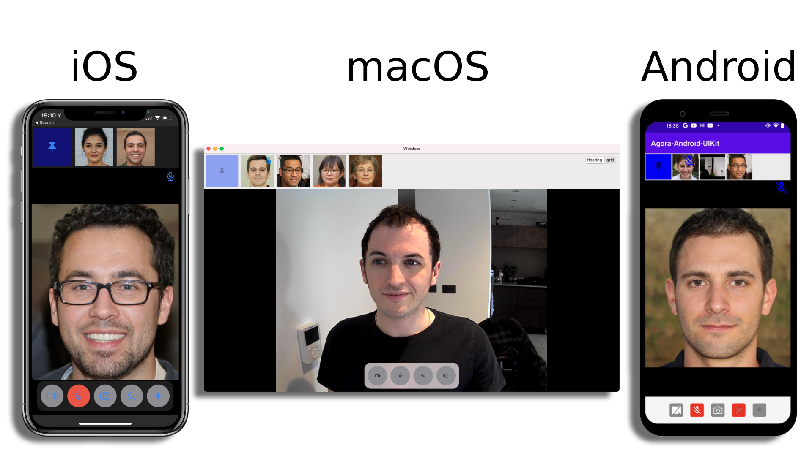
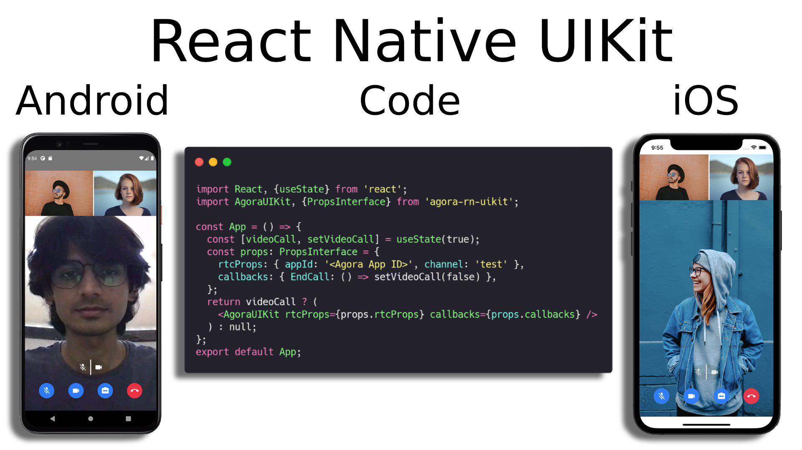

## Hi there, welcome to Agora.io's Community GitHub 👋

  

This community page is where we put all our exciting example projects, and open source products like Agora UIKit. Scroll down or click the [Repositories](https://github.com/orgs/AgoraIO-Community/repositories) tab to dive in.

You may also want to check out the [Developer Resources](https://www.agora.io/en/developer-resources/) page for links to our blogs, tips for scaling your Agora application, and more.

### Core Content

- [Code Samples](#code-samples)
  - [iOS](#ios)
  - Android
  - Flutter
  - React Native
- [Agora UIKit](#agora-uikit)

### Code Samples

#### iOS

| Project Name                                                 | Blog                                                         | Core Features                                                | Description                                                  |
| ------------------------------------------------------------ | ------------------------------------------------------------ | ------------------------------------------------------------ | ------------------------------------------------------------ |
| [Agora-iOS-Swift-Example](https://github.com/AgoraIO-Community/Agora-iOS-Swift-Example) | [How to Build a Live Video Streaming iOS App with Agora](https://www.agora.io/en/blog/how-to-build-a-live-video-streaming-ios-app-with-agora/) | - Live Broadcasting - Camera Controls - Beautification - Token Fetching - Layout Camera Feeds | This example project goes through all the basic conceptsyou need to get started with Agora in your Swift application. Check out this project to see how to create an iOS application with video calling from scratch. |
|                                                              |                                                              |                                                              |                                                              |
|                                                              |                                                              |                                                              |                                                              |

### Agora UIKit

One project we're working on at the Agora.io Community GitHub is Agora UIKit.

These open source libraries aim to simplify the integration of Agora video calling in your applications. They are available for [iOS](https://github.com/AgoraIO-Community/iOS-UIKit), [Android](https://github.com/AgoraIO-Community/Android-UIKit), [React Native](https://github.com/AgoraIO-Community/ReactNative-UIKit), [Flutter](https://github.com/AgoraIO-Community/Flutter-UIKit), and [macOS](https://github.com/AgoraIO-Community/iOS-UIKit).

The native iOS, Android and macOS default UIKit views look similar to these:

  

The React Native UIKit looks like this on Android and iOS

  

